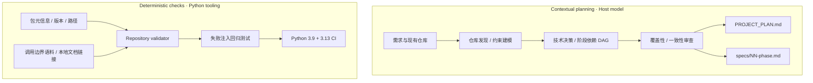

<p align="right"><b>中文</b> · <a href="README_EN.md">English</a></p>

# Project Planner · Specification Engineering

**Repository-aware Planning · Phase Dependency Modeling · Artifact Contracts · Package Validation**

[](https://github.com/yuanjuju/project-planner/actions/workflows/validate.yml)
[](https://github.com/yuanjuju/project-planner/releases)
[](LICENSE)

面向 Codex 的项目规划插件与独立 Skill，将**项目目标、仓库现状、架构约束与验收条件**组织为持久化的 `PROJECT_PLAN.md` 和 `specs/` 阶段规格。

围绕 **Repository Discovery → Constraint Modeling → Phase DAG → Consistency Review** 构建规划工作流；配套标准库校验器、失败注入回归测试与双版本 Python CI，检查插件包的身份、版本、路径、元信息和文档完整性。

[技术架构](docs/architecture.md) · [验证证据](docs/verification.md) · [安装与使用](docs/getting-started.md) · [规划案例](examples/privacy-first-expense-tracker.md) · [评估协议](docs/evaluation.md)

`Codex Plugin / Skill` · `Python Standard Library` · `Markdown Contracts` · `Dependency DAG` · `Regression Testing` · `GitHub Actions`

## Technical Scope

| 工程域 | 机制与约束 | 实现入口 |
| --- | --- | --- |
| **Repository-aware Discovery** | 先读取现有指令、清单、源码布局与规划文档，再建立目标、约束和非目标；保留已确认的架构决策 | [Skill workflow](plugins/project-planner/skills/project-planner/SKILL.md) |
| **Artifact Contract Design** | 总体计划负责系统边界与决策；阶段规格负责输入、输出、依赖、失败状态和可观测验收条件 | [Plan template](plugins/project-planner/skills/project-planner/references/project-plan-template.md) · [Phase template](plugins/project-planner/skills/project-planner/references/phase-spec-template.md) |
| **Dependency-oriented Decomposition** | 按交付依赖组织阶段 DAG，表达并行分支与汇合点；规划审查负责覆盖性和无环性检查 | [Dependency example](examples/privacy-first-expense-tracker.md) |
| **Metadata & Identity Reconciliation** | 对齐 marketplace、plugin、skill 与 VERSION；拒绝重复 JSON key 和受限 frontmatter 中的重复键 | [Validator](scripts/validate.py) |
| **Path & Release Invariants** | 规范化路径并检查根目录边界；拒绝发布文件软链接，检查本地链接及选定敏感信息模式 | [Validation internals](docs/architecture.md) |
| **Trigger-boundary Contract** | 维护显式规划、既有项目更新、直接实现、只读解释等正负调用场景 | [16-case corpus](tests/trigger-cases.json) |
| **Regression & Evidence** | 在临时副本注入元信息漂移、路径逃逸、缺失策略等错误；导出测试清单和源码哈希 | [Tests](tests/test_validate.py) · [Evidence builder](scripts/build_evidence.py) |

## Planning & Assurance Architecture



模型负责上下文相关的规划判断，Python 工具负责确定性的包结构校验。当前校验器**不会自动验证生成计划的需求覆盖率或 DAG 无环性**；这些检查由 Skill 工作流和前向评估协议规定。

## Verification Evidence

| 验证对象 | 当前记录 | 证据含义 |
| --- | --- | --- |
| **Regression suite** | **12 / 12** 测试通过 | 1 个有效仓库基线 + 11 个失败注入场景 |
| **Trigger corpus** | **16** 个场景，8 trigger / 8 skip | 调用边界语料结构通过校验；不表示模型调用准确率 |
| **Compatibility matrix** | Python **3.9 / 3.13** | CI 在两种解释器上运行相同质量检查 |
| **Runtime dependencies** | **0** 个插件运行时依赖 | 分发内容为指令与模板；开发校验仅使用 Python 标准库 |
| **Model forward evaluation** | 本轮未执行 | 不宣称规划质量分数或模型路由通过率 |

详细失败矩阵见 [验证报告](docs/verification.md)，逐项测试结果、运行解释器与源码 SHA-256 见 [机器可读记录](docs/assets/verification.json)。数字对应记录中的源码；每个提交的远端状态以 CI 为准。

## Artifact Model

```text
target-project/
├── PROJECT_PLAN.md       # 系统范围、约束、架构决策、阶段图、验证策略
└── specs/
    ├── 01-foundation.md  # 阶段输入 / 输出 / 依赖 / 验收条件
    ├── 02-core-flow.md
    └── ...
```

这些文件名是输出形态示意，实际阶段适配目标项目。模板区分已确认事实、拟定决策、假设与待解决问题；对既有规划文件先完整读取，再保留有效内容并合并。`AGENTS.md` 保持简明的工作指令职责。

以离线记账案例为例，收据管理与 CSV 导出共享账本基础，可形成并行分支，最终汇合到交付验证。案例还把离线约束、媒体生命周期、CSV 转义与取消清理落实到阶段验收。见 [完整案例](examples/privacy-first-expense-tracker.md)。

## Run & Reproduce

在具备 Python 3.9+ 的仓库根目录运行：

```bash
make check
python3 scripts/build_evidence.py
```

第一条执行包校验与回归测试；第二条重新验证后导出证据 JSON。不安装第三方依赖，不调用模型服务。

插件安装、独立 Skill 安装及 Windows 使用方式见 [安装指南](docs/getting-started.md)。安装后可这样提出任务：

```text
Use $project-planner to inspect this codebase, preserve its conventions,
and create PROJECT_PLAN.md and phased specifications for team workspaces.
```

该 Skill 默认交付规划与规格，产品代码实现由后续任务承担。

## Repository Layout

```text
plugins/project-planner/     # 插件清单、Skill、UI 元信息、两类文档模板
scripts/validate.py         # 确定性包校验
scripts/build_evidence.py   # 执行验证并导出源码关联证据
tests/                      # 回归测试与调用边界语料
docs/                       # 架构、评估协议、证据、安装说明
examples/                   # 依赖图与阶段验收示例
.github/workflows/          # Python 3.9 / 3.13 检查
```

## Engineering Boundaries

- 当前分发包没有遥测、常驻服务或凭据需求；宿主 Codex 可以读取和修改用户划定范围内的规划文件。
- 元信息解析采用受限语法；Markdown 链接使用正则检查，不覆盖远端 URL 和锚点有效性。
- 敏感信息模式检查不能替代完整安全审计；回归测试不是穷尽测试。
- 下一步可扩展生成规格的结构检查与独立前向评估记录；这些尚未包含在当前能力中。

贡献方式见 [CONTRIBUTING](CONTRIBUTING.md)，安全说明见 [SECURITY](SECURITY.md)，许可证为 [MIT](LICENSE)。本项目为社区项目，与 OpenAI 无隶属或背书关系。
