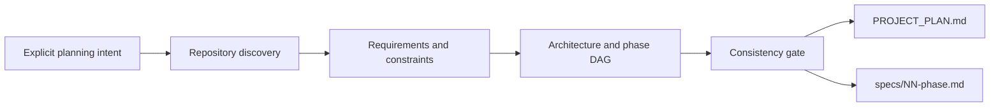

<p align="right"><a href="README.md">中文</a> · <b>English</b></p>

# Project Planner · Specification Engineering

**Repository-aware Planning · Phase Dependency Modeling · Artifact Contracts · Package Validation**

[](https://github.com/yuanjuju/project-planner/actions/workflows/validate.yml)
[](https://github.com/yuanjuju/project-planner/releases)
[](LICENSE)
[](#privacy-and-dependencies)

An open-source Codex plugin and standalone skill that turns a software-project idea or an existing repository into a durable `PROJECT_PLAN.md` and implementation-ready phase specifications under `specs/`.

It plans; it does not implement product code.

[Architecture](docs/architecture.md) · [Verification evidence](docs/verification.md) · [Installation guide](docs/getting-started.md) · [Evaluation protocol](docs/evaluation.md)

## Technical Scope

| Domain | Mechanism | Entry point |
| --- | --- | --- |
| Repository discovery | Inspect instructions, manifests, code and existing plans before proposing changes | [Skill](plugins/project-planner/skills/project-planner/SKILL.md) |
| Artifact contracts | Separate system decisions from phase inputs, outputs, dependencies and acceptance | [Templates](plugins/project-planner/skills/project-planner/references/project-plan-template.md) |
| Dependency modeling | Shared prerequisites, parallel branches and integration gates | [Worked example](examples/privacy-first-expense-tracker.md) |
| Metadata reconciliation | Cross-check identities and versions; reject duplicate JSON and frontmatter keys | [Validator](scripts/validate.py) |
| Release invariants | Resolve paths, reject escaping references and symlinks, inspect local links | [Internals](docs/architecture.md) |
| Trigger contract | Positive and negative invocation scenarios | [Corpus](tests/trigger-cases.json) |
| Regression evidence | Inject failures into temporary copies and export source-addressed results | [Tests](tests/test_validate.py) · [Evidence builder](scripts/build_evidence.py) |

## Verification Evidence

| Layer | Recorded result | Scope |
| --- | --- | --- |
| Regression suite | **12 / 12** passing | One valid baseline and eleven injected-failure cases |
| Trigger corpus | **16** cases: 8 trigger / 8 skip | Corpus structure, not measured model routing accuracy |
| CI matrix | Python **3.9 / 3.13** | Same package checks and regression suite |
| Runtime dependencies | **0** | Instructions and templates; validation uses the standard library |
| Model forward evaluation | **Not run** in this update | No model-quality score is claimed |

The [JSON snapshot](docs/assets/verification.json) records test IDs, interpreter version and source hashes. Rebuild it with `python3 scripts/build_evidence.py`. The validator checks the package; requirement coverage and generated phase-DAG acyclicity remain model/reviewer obligations. The [architecture](docs/architecture.md) explains these boundaries and the two execution planes.

## What it produces

```text
your-project/
├── PROJECT_PLAN.md
└── specs/
    ├── 01-project-foundation.md
    ├── 02-core-capability.md
    └── ...
```

The planner adapts the sections to the project instead of assuming every project has a browser client, server, and database. It also inspects existing repositories before writing and does not silently replace existing planning documents.

## How it works



The skill separates model judgment from deterministic guarantees. Codex handles context-sensitive architecture and decomposition; repository validation enforces package identity, version consistency, safe paths, metadata integrity, local links, and release hygiene.

## Install as a plugin

Add this repository as a Codex marketplace, then install the plugin:

```bash
codex plugin marketplace add yuanjuju/project-planner --ref v1.0.0
codex plugin add project-planner@project-planner
```

Use `--ref main` instead of the version tag to track the latest unreleased changes.

If your Codex version does not yet expose plugin commands, use the standalone-skill method below.

## Install only the skill

Ask Codex to install the skill from this repository:

```text
Use $skill-installer to install the project-planner skill from
https://github.com/yuanjuju/project-planner/tree/main/plugins/project-planner/skills/project-planner
```

For a first-time manual user-level installation:

```bash
git clone https://github.com/yuanjuju/project-planner.git
mkdir -p "$HOME/.agents/skills"
cp -R project-planner/plugins/project-planner/skills/project-planner "$HOME/.agents/skills/project-planner"
```

On Windows PowerShell:

```powershell
git clone https://github.com/yuanjuju/project-planner.git
New-Item -ItemType Directory -Force "$HOME/.agents/skills" | Out-Null
Copy-Item -Recurse project-planner/plugins/project-planner/skills/project-planner "$HOME/.agents/skills/project-planner"
```

Codex normally detects skill changes automatically. Restart Codex if the skill does not appear.

For upgrades, prefer the plugin command or `$skill-installer`; a recursive manual copy can retain stale files from an older version.

## Usage

Invoke the skill explicitly:

```text
Use $project-planner to plan a privacy-first expense tracker for iOS.
```

For an existing repository:

```text
Use $project-planner to inspect this codebase, preserve its conventions,
and create a phased plan for adding team workspaces.
```

Useful details to provide include the target platform, constraints, preferred stack, core flows, and non-goals. When details are missing, the planner records assumptions and only asks questions that materially change the plan.

Because the skill writes durable planning files, use it in a version-controlled repository and review the resulting diff before implementation. It reads only the project content placed in scope and does not run the planned product code.

## Design choices

- `PROJECT_PLAN.md` stores architecture and delivery planning.
- `AGENTS.md` remains a concise Codex instruction file rather than a project-design dump.
- Phase dependencies may form a directed acyclic graph instead of an artificial linear sequence.
- Sections such as databases, APIs, UI states, migrations, and observability are included only when relevant.
- Existing files are read and merged deliberately; they are not silently overwritten.
- Confirmed facts, proposed decisions, assumptions, and open questions remain distinguishable.
- Implicit invocation is enabled only when the request itself clearly asks for durable planning; quick brainstorming, explanations, task lists, and direct implementation are explicit negative cases.

See the compact [expense-tracker example](examples/privacy-first-expense-tracker.md) for the expected reasoning shape and [evaluation strategy](docs/evaluation.md) for the quality model.

## Quality gates

Run the full dependency-free check locally:

```bash
make check
```

This executes:

- a release-invariant validator for plugin, marketplace, skill, version, path, link, and secret-hygiene checks;
- mutation-style regression tests proving that metadata drift, path traversal, broken links, and release placeholders fail validation;
- structural checks for a version-controlled trigger-boundary corpus.

The GitHub Actions workflow runs the same gates on the oldest and newest supported Python versions. Model behavior is forward-tested separately because a lexical test cannot honestly prove a routing or planning decision.

## Repository layout

```text
.
├── .github/workflows/validate.yml
├── docs/evaluation.md
├── examples/
├── marketplace.json
├── plugins/project-planner/
│   ├── .codex-plugin/plugin.json
│   └── skills/project-planner/
│       ├── SKILL.md
│       ├── agents/openai.yaml
│       └── references/
├── scripts/validate.py
├── tests/
└── VERSION
```

## Privacy and dependencies

The distributed plugin contains instructions and Markdown templates only. It has no runtime dependencies, telemetry, network service, or credential requirements. Repository validation uses only Python's standard library and is development tooling, not plugin runtime code. Codex may read and write planning files in the repository the user places in scope.

## Contributing

Issues and pull requests are welcome. See [CONTRIBUTING.md](CONTRIBUTING.md) for quality gates and the behavior-release checklist.

## License

[MIT](LICENSE)

This is an unofficial community project and is not affiliated with or endorsed by OpenAI.
