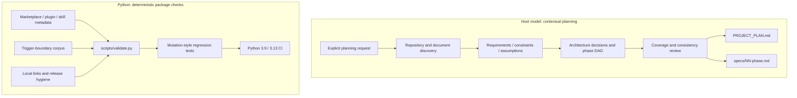
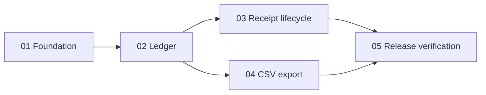

# Planning architecture and assurance boundaries

Project Planner distributes a declarative skill, two artifact templates, and plugin metadata. The host model interprets the skill; the repository's Python tooling validates the distributable package. There is no background planning service or custom model runtime.

## Two execution planes

The package validator does **not** parse a generated project plan, prove a phase DAG is acyclic, or measure model routing accuracy. Those are explicit review obligations in the skill and forward-evaluation protocol.

## Artifact contracts

| Artifact | Responsibility | Contract owner |
| --- | --- | --- |
| `PROJECT_PLAN.md` | System scope, constraints, decisions, contracts, phase graph and verification strategy | [Project-plan template](../plugins/project-planner/skills/project-planner/references/project-plan-template.md) |
| `specs/NN-phase.md` | A reviewable delivery unit with inputs, outputs, dependencies, failure modes and acceptance criteria | [Phase template](../plugins/project-planner/skills/project-planner/references/phase-spec-template.md) |
| `AGENTS.md` | Concise host instructions; architecture remains in planning documents | [Skill workflow](../plugins/project-planner/skills/project-planner/SKILL.md) |

These are Markdown contracts interpreted by the model and reviewer, not a machine-enforced schema. Proposed paths must remain distinguishable from files observed in the repository. Existing planning documents must be read in full and merged deliberately.

## Dependency-oriented decomposition

For the [expense-tracker example](../examples/privacy-first-expense-tracker.md), the ledger is a prerequisite for both receipt management and CSV export. These branches converge at release verification:

This example is authored documentation, not a measured model output. Its purpose is to show how shared prerequisites, parallel work, and acceptance criteria fit together.

## Deterministic validation internals

| Mechanism | Implementation | Failure detected |
| --- | --- | --- |
| JSON loading with duplicate-key rejection | `read_json`, `reject_duplicate_keys` | Ambiguous metadata that ordinary JSON parsing could silently replace |
| Canonical path resolution | `resolve_inside` | Package references that escape the expected root |
| Identity and version reconciliation | `validate_marketplace`, `validate_plugin` | Name, version, category or package-path drift |
| Restricted frontmatter parsing | `parse_frontmatter`, `validate_skill` | Duplicate/unsupported keys and missing UI metadata |
| Corpus contract checks | `validate_trigger_cases` | Duplicate IDs, absent explanations, or insufficient positive/negative cases |
| Link and hygiene checks | `validate_markdown_links`, `validate_hygiene` | Broken local links, unresolved release markers, selected credential patterns and local paths |

The frontmatter reader accepts the repository's constrained syntax; it is not a general YAML parser. Markdown links are checked with a regular expression, not a complete Markdown AST. Credential pattern checks do not constitute a security audit. Network links and anchor targets are outside the current local-link check.

## Design decisions

- **No runtime dependency bootstrap:** shipped assets are instructions and templates; development validation uses the Python standard library.
- **Model judgment stays explicit:** architecture choices and requirement interpretation need context; deterministic checks cover package invariants.
- **Planning stops at handoff:** generated product code is outside the skill's default scope.
- **Adaptive templates:** UI states, migrations, observability and API contracts are included only where the target project needs them.

See [verification evidence](verification.md), [evaluation strategy](evaluation.md), and [installation and usage](getting-started.md).
