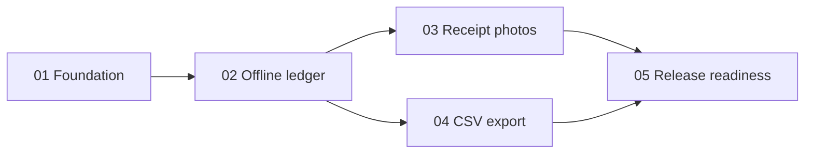

# Example: privacy-first expense tracker

This compact example demonstrates the planner's reasoning shape. It is not a
fixed template: an actual run should adapt to the repository and the user's
constraints.

## Prompt

> Use `$project-planner` to plan a single-user iOS expense tracker. It must work
> fully offline, store receipt photos locally, export CSV, and avoid accounts,
> analytics, and cloud services. Create implementation-ready planning files,
> but do not implement the app.

## Expected artifact graph

```text
PROJECT_PLAN.md
specs/
├── 01-foundation-and-privacy-baseline.md
├── 02-offline-expense-ledger.md
├── 03-receipt-photo-lifecycle.md
├── 04-csv-export.md
└── 05-accessibility-resilience-and-release.md
```



## Selected project decisions

| Decision | Proposed choice | Why it matters |
|---|---|---|
| Persistence | Local database behind a repository boundary | Keeps storage choice testable and replaceable |
| Receipt media | App-private files with database references | Avoids large blobs in the primary store |
| Metadata | Strip location-bearing EXIF before persistence | Enforces the privacy requirement at ingestion |
| Export | RFC 4180-compatible UTF-8 CSV | Makes output portable and testable |
| Networking | No network entitlement or API client | Turns “offline” into an architectural constraint |

Open choices such as minimum iOS version and persistence framework should be
marked `Proposed` or `Open`; the planner should not present them as user facts.

## Selected phase excerpt

```markdown
# Phase 04: CSV export

## Outcome

The user can export the currently filtered ledger as a portable UTF-8 CSV file
without sending data to a remote service.

**Depends on:** Phase 02
**Produces:** Export service, share-sheet handoff, and format tests

## Verification

- Verify commas, quotes, line breaks, emoji, and non-Latin text round-trip.
- Verify cells beginning with `=`, `+`, `-`, or `@` cannot become spreadsheet formulas.
- Verify cancellation and export failure leave no orphaned temporary file.

## Acceptance criteria

- [ ] Exported row count and ordering match the active ledger filter.
- [ ] The export works in airplane mode on a clean install.
- [ ] Temporary export files are removed after completion or cancellation.
```

The important property is traceability: every requirement maps to an owning
phase, parallel work is explicit, and acceptance criteria describe observable
evidence rather than implementation activity.
